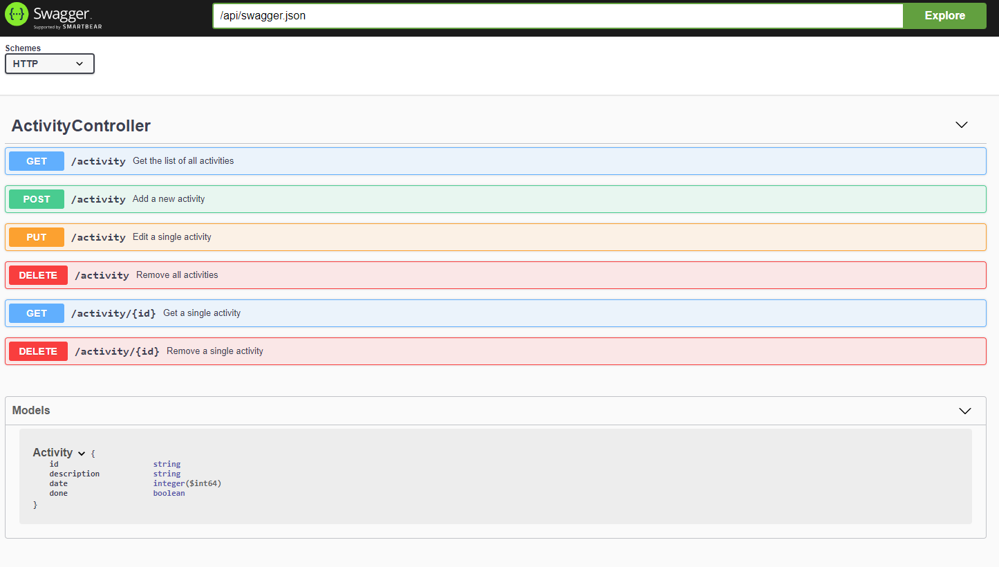
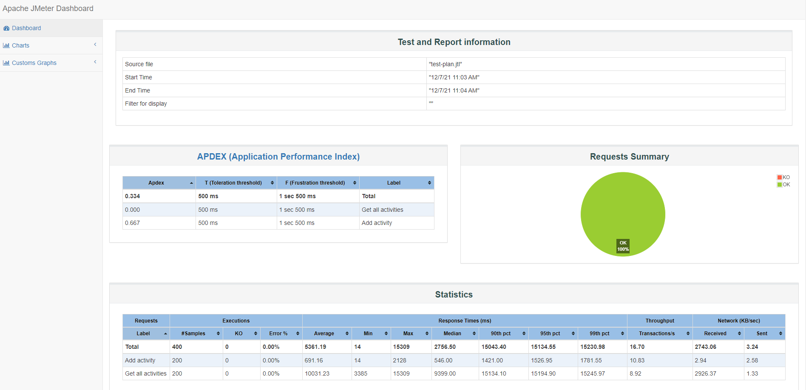

# Tasks Management System (TMS)

Description
---

TMS is a simple REST service project that serves APIs for managing your own activity tasks.

About implementation
---

TMS uses [Dropwizard](https://www.dropwizard.io/en/latest/index.html) framework to serve the APIs.
The default database implementation is [H2](https://h2database.com/html/main.html) and the database is located into `target/db`.

To see an example of usages for MySql please point to the test cases. 

Design
---

TODO add picture for describing desing

Testing
---

The code base contains a set of unit and integration tests that cover at least 85% of the code. During the build the code coverage is checked 
by [JaCoCo](https://www.jacoco.org/jacoco/). the minimum allowed coverage is 85%.  
The report is published into `target/site`

Open API
---

TMS exposes a OpenAPI `http://localhost:8080/api/swagger`. the page describes the REST APIs. To get a JSON representation use `http://localhost:8080/api/swagger.json`

How to start the TMS application
---

1. Run `mvn clean install` to build your application
2. Init the database `java -jar target/task-management-system-1.0-SNAPSHOT.jar db migrate config.yml`
3. Start application with `java -jar target/task-management-system-1.0-SNAPSHOT.jar server config.yml`
4. To check that your application is running enter url `http://localhost:8080/api/`

Health Check
---

To see your applications health enter url `http://localhost:8080/api/healthcheck`

Dockerize your application
---

After you have built the application run:

`docker build -t oracle/task-management-system:1 -f target/docker/Dockerfile .`

To run the app:

`docker-compose -f src/main/docker/docker-compose.yml up tms`

Run performance test
---

There is a performance test plan that can be started easily

`rm -fr target/jmeter && docker-compose -f src/main/docker/docker-compose.yml up tms rest-perf`

the results and reports will be placed into `target/jmeter`

here is an example of jmeter report

