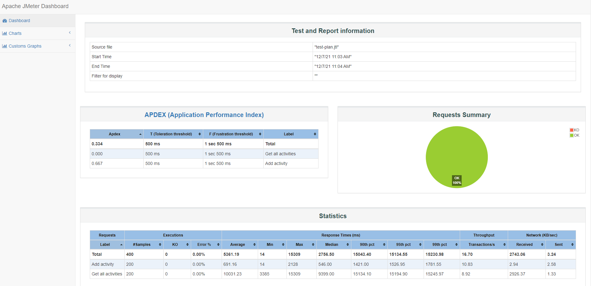

# TMS

How to start the TMS application
---

1. Run `mvn clean install` to build your application
2. Init the database `java -jar target/task-management-system-1.0-SNAPSHOT.jar db migrate config.yml`
3. Start application with `java -jar target/task-management-system-1.0-SNAPSHOT.jar server config.yml`
4. To check that your application is running enter url `http://localhost:8080`

Health Check
---

To see your applications health enter url `http://localhost:8080/healthcheck`

Dockerize your application
---

After you have built the application run:

`docker build -t oracle/task-management-system:1 -f target/docker/Dockerfile .`

To run the app:

`docker-compose -f src/main/docker/docker-compose.yml up tms`

Run performance test
---

There is a performance test plan that can be started easily

`rm -fr target/jmeter && docker-compose -f src/main/docker/docker-compose.yml up tms rest-perf`

the results and reports will be placed into `target/jmeter`

here is an example of jmeter report

