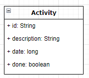

Build on top of Dropwizard framework, the default database implementation is H2 and the database is located into target/db.
_To see an example of usages for MySql please point to the test cases_

TMS uses JPA (hibernate) for storing the data into database.

#### Schema

The DB schema has been managed using the [dropwizard-migrations](https://www.dropwizard.io/en/latest/manual/migrations.html) module.
Please find the definition on the project _resource_ folder.

#### Entity

The first implementation uses a single entity [Activity.java](https://github.com/marcosperanza/tms/blob/17bf95ea5b5b6e726f5ffe6872c655fdd104bbcc/src/main/java/com/oracle/interview/db/entity/Activity.java) to manage the _task_ list

The entity contains all task created by the user. The DB access is regulated from an interface [ActivityRepository.java](https://github.com/marcosperanza/tms/blob/17bf95ea5b5b6e726f5ffe6872c655fdd104bbcc/src/main/java/com/oracle/interview/db/ActivityRepository.java)

#### REST

The REST APIs are defined in [ActivityController.java](https://github.com/marcosperanza/tms/blob/17bf95ea5b5b6e726f5ffe6872c655fdd104bbcc/src/main/java/com/oracle/interview/resources/ActivityController.java)
and the CRUD APIs are documented with OpenAPI annotation, here is a screenshot that shows the exposed APIs

