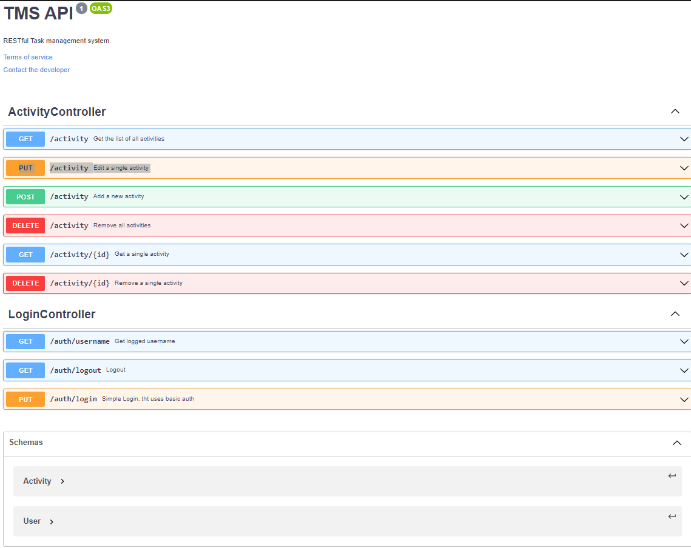

Build on top of Dropwizard framework, the default database implementation is H2 and the database is located into target/db.
_To see an example of usages for MySql please point to the test cases_

TMS uses JPA (hibernate) for storing the data into database.

#### Schema

The DB schema has been managed using the [dropwizard-migrations](https://www.dropwizard.io/en/latest/manual/migrations.html) module.
Please find the definition on the project _resource_ folder.


#### Entity

The first implementation uses two entities 
- [Activity.java](https://github.com/marcosperanza/tms/blob/master/src/main/java/com/oracle/interview/db/entity/Activity.java) to manage the _task_ list
- [User.java](https://github.com/marcosperanza/tms/blob/master/src/main/java/com/oracle/interview/db/entity/User.java) to manage the _users_ list

predefined users are
- username: auth
- password: secret

- username: basic
- password: secret


The entity contains all tasks created by the user. The not authenticated users will store the activity as __GUEST__ so all can reads/writes elements. 
Authenticated users have their own space in the database.

The DB access is regulated from an interface [ActivityRepository.java](https://github.com/marcosperanza/tms/blob/master/src/main/java/com/oracle/interview/db/ActivityRepository.java)

#### Authentication

The server uses a **Basic Authentication** all RESTs have an optional authentication, so the app works also if the users are not authenticated.
The only REST api that requires authentication is the remove all data from database.:

```java 
@DELETE
@UnitOfWork
@RolesAllowed("AUTHENTICATED")
public Response removeAll()`
```

For semplicity I've implemented a [LoginController.java](https://github.com/marcosperanza/tms/blob/master/src/main/java/com/oracle/interview/resources/LoginController.java) to handle a very-very basic auth. 


#### REST

The REST APIs are defined in [ActivityController.java](https://github.com/marcosperanza/tms/blob/master/src/main/java/com/oracle/interview/resources/ActivityController.java)
and the CRUD APIs are documented with OpenAPI annotation, here is a screenshot that shows the exposed APIs



