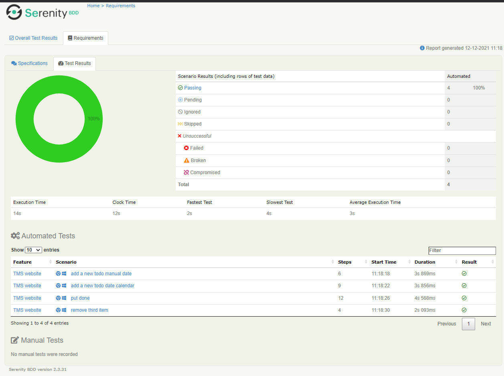

### Development Test and BDD

The project is spit into two main codebase, where is present the server code and ui React.js code
- [TMS server](https://github.com/marcosperanza/tms)
- [TMS UI](https://github.com/marcosperanza/tms-ui)

Moreover, a performance test suite and BDD (Behavior Driven Development) suite have been created.


Run TMS locally
---

1. Clone repo [TMS server](https://github.com/marcosperanza/tms)  and [TMS UI](https://github.com/marcosperanza/tms-ui)
2. cd `tms`
```
mvn clean install
java -jar target/task-management-system-1.0-SNAPSHOT.jar db migrate config.yml
java -jar target/task-management-system-1.0-SNAPSHOT.jar server config.yml

``` 
4. cd `tms-ui`
```
npm install
npm run generate
npm start
```

Run TMS on docker
---
cd `tms`

```
mvn clean install
docker build -t marcosperanza79/tms -f target/docker/Dockerfile .
``` 

cd `tms-ui`

```
npm install
npm run build
docker build -t marcosperanza79/tms-ui -f Dockerfile .
``` 

```
docker-compose -f src/main/docker/conf/docker-stack.yml up
```

Performance
---

The performance tests has been designed to invoke directly the REST endpoints. The test plan has been developed on top 
of [JMeter](https://jmeter.apache.org/), you can find the plan directly in the [TMS codebase](https://github.com/marcosperanza/tms/tree/master/src/test/jmeter) 

To run the test execute following instructions:

The file uses `${SRC}` environment variable for mounting a volume that point to the project codebase needed for:
- wait-for-it.sh: a script that checks the real presence of the service in the swarm
- test-plan.jmx: the test plan, present in the project codebase folder, `src/test/jmeter`
- all output reports and logs

`rm -fr target/jmeter && docker-compose -f src/main/docker/conf/docker-stack-dev.yml up tms rest-perf`

the results and reports will be placed into `target/jmeter`

here is an example of jmeter report


BDD (Behavior Driven Development)
---

A dedicated code base for the BDD has been created:

- [BDD test project](https://github.com/marcosperanza/tms-ui-test-suite)

the BDD has been developed on top of [serenity-js](https://serenity-js.org/):  a framework that users selenium.

Serenity uses a more comprehensive pattern, called [Screen-Play-Pattern](https://serenity-js.org/handbook/design/screenplay-pattern.html) that allow a very clean and readeble code for your BDD test suite.

here is an example:

```ts
it(`add a new todo date calendar`, () =>
    actorCalled('Jasmine').attemptsTo(
    OpenTms.called(),
    Ensure.that(Website.title(), includes('TMS')),
    FillActivityDesc.called('TEST AUTO'),

    OpenCalendar.called(),
    Click.on(Tms.calendarDlgSndRow3Col),
    SaveCalendarDate.called(),
    SaveActivity.called(),

    Wait.until(Tms.firstItem, isPresent()),
    Ensure.that(Text.of(Tms.firstItem), equals('TEST AUTO')),

));

```


The BDD test suite test the complete user interaction:


- clone the project https://github.com/marcosperanza/tms-ui-test-suite


The test suite uses an environment variable for locating the target url, if not set a default value is used `http://localhost:3000`

**WARNING** the test suite will clean the database, DO NOT RUN IN PRODUCTION.

```
npm install
export TARGET_URL=http://my_stage_url
npm test
```

A detained test report will be created into `target/site`



