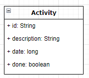

## Welcome to TMS REST server

The Task Management System (TMS) is a simple REST server that serves APIs for managing your own activity tasks.
Build on top of Dropwizard framework, the default database implementation is H2 and the database is located into target/db.

_To see an example of usages for MySql please point to the test cases_


### About implementation

TMS uses JPA (hibernate) for storing the data into database.

#### Schema

The DB schema has been managed using the [dropwizard-migrations](https://www.dropwizard.io/en/latest/manual/migrations.html) module. 
Please find the definition on the project _resource_ folder.


#### Entity

The first implementation uses a single entity [Activity.java](https://github.com/marcosperanza/tms/blob/17bf95ea5b5b6e726f5ffe6872c655fdd104bbcc/src/main/java/com/oracle/interview/db/entity/Activity.java) to manage the _task_ list 



The entity contains all task created by the user. The DB access is regulated from an interface [ActivityRepository.java](https://github.com/marcosperanza/tms/blob/17bf95ea5b5b6e726f5ffe6872c655fdd104bbcc/src/main/java/com/oracle/interview/db/ActivityRepository.java)


#### REST

The REST APIs are defined in [ActivityController.java](https://github.com/marcosperanza/tms/blob/17bf95ea5b5b6e726f5ffe6872c655fdd104bbcc/src/main/java/com/oracle/interview/resources/ActivityController.java) 
and the CRUD APIs are documented with OpenAPI annotation, here is a screenshot that shows the exposed APIs


### Deployment

For deploiyng in production or stage you can choose multiple ways: Docker/swarm or k8b. Some scripts have been created to 
deploy a default configuration.

All project docker images are published into [Docker Hub](https://hub.docker.com/u/marcosperanza79)

- [TMS](https://hub.docker.com/u/marcosperanza79/tms)
- [TMS-UI](https://hub.docker.com/u/marcosperanza79/tms-ui)

#### Docker/SWARM services

- **Compose**

Deploy on the same node Server and UI

```
docker-compose -f src/main/docker/conf/docker-stack.yml up
```

- **SWARM**

Deploy on docker swarm Server and UI

```
docker stack deploy -c src/main/docker/conf/docker-stack.yml tms
```

#### Kubernates

You need a production k8b cluster. i.e. Oracle Kubernates Cluster Service

```
kubectl create -f src/main/k8b/k8b-tms-prod.deployment.yml
kubectl expose deployment tms --port=80 --type=LoadBalancer
```

inspect the loadbalancer for discovering the public IP. The UI will be exposed on the `http://<public_ip>`

```
kubectl get service tms
```


### Develop

To run the server and ui:

`docker-compose -f src/main/docker/conf/docker-stack.yml up tms tms-ui`

There is also a performance test plan that can be started easily. 

The file uses `${SRC}` environment variable for mounting a volume that point to the project codebase needed for:
- wait-for-it.sh: a script that checks the real presence of the service in the swarm
- test-plan.jmx: the test plan, present in the project codebase folder, `src/test/jmeter`
- all output reports and logs

`rm -fr target/jmeter && docker-compose -f src/main/docker/conf/docker-stack-dev.yml up tms rest-perf`

the results and reports will be placed into `target/jmeter`

here is an example of jmeter report


