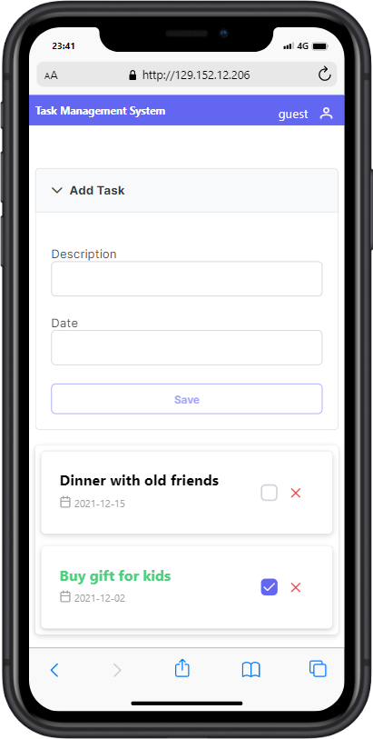

## Welcome to TMS REST server

[The Task Management System (TMS)](https://github.com/marcosperanza/tms) is a simple REST server that serves APIs for managing your own activity tasks.
[The Task Management System User interface (TMS-UI)](https://github.com/marcosperanza/tms-ui) is ReactJS application that allow the user to manage a personal TODO list.

# Table of content
- [About implementation](https://marcosperanza.github.io/tms/about-implementation.html)
- [About UI implementation](https://marcosperanza.github.io/tms/about-implementation-ui.html)
- [Deployment](https://marcosperanza.github.io/tms/deployment.html)
- [Development/Performance test and BDD](https://marcosperanza.github.io/tms/develop-environmet.html)
- [CI/CD](https://marcosperanza.github.io/tms/ci-cd.html)
- [Code Coverage report](https://marcosperanza.github.io/tms/jacoco/index.html) /  [Code Coverage UI report](https://marcosperanza.github.io/tms/lcov-report/index.html)
- [JacaDocs](https://marcosperanza.github.io/tms/apidocs/index.html) 

### Application

The user interface has been designed to manage a personal _TODO list_.

#### Mobile

The ui is reactive to the small screen, a breakpoint has been added on medium screen (768px) and an optimized for mobile calendar 
widget has been used.

This is an example of the home page on a iPhone 5/SE

and this is the dedicated calendar data chooser:

